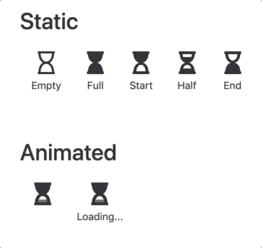

# vue-hourglass

An SVG and CSS animated hourglass conveniently wrapped up in a Vue component.

## Installation

    npm install vue-hourglass --save

## Basic Usage

    <!-- Animated Examples -->
    <hourglass />
    <hourglass label="Loading..." />

    <!-- Static Examples -->
    <hourglass :animate="false" label="Empty" empty />
    <hourglass :animate="false" label="Full" full />
    <hourglass :animate="false" label="Start" start />
    <hourglass :animate="false" label="Half" half />
    <hourglass :animate="false" label="End" end />